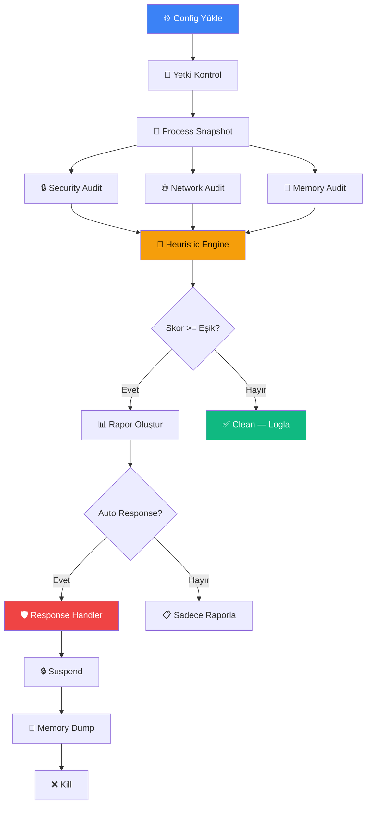
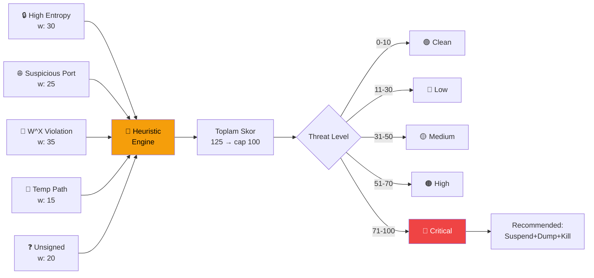
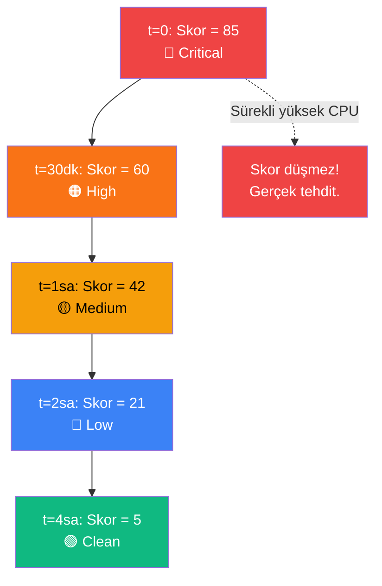
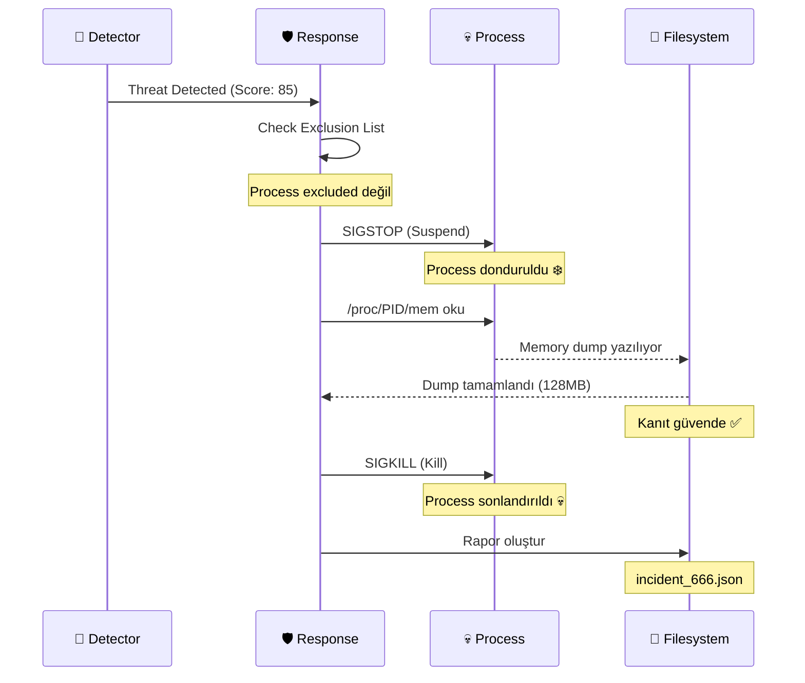
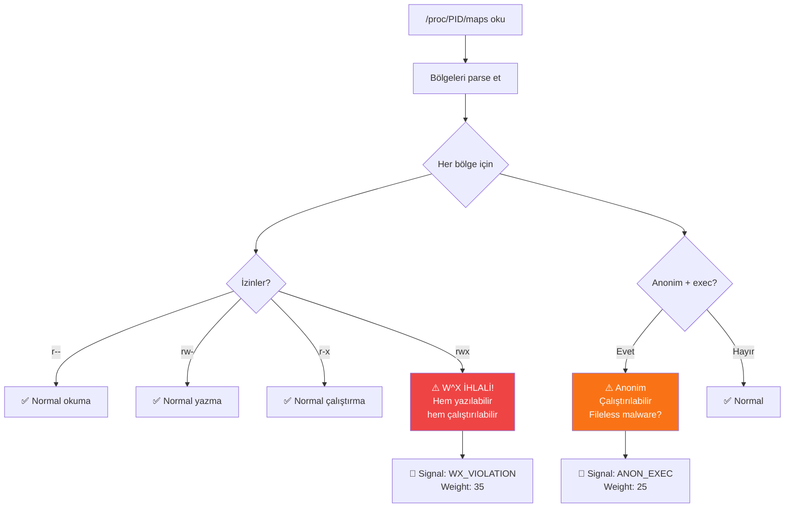
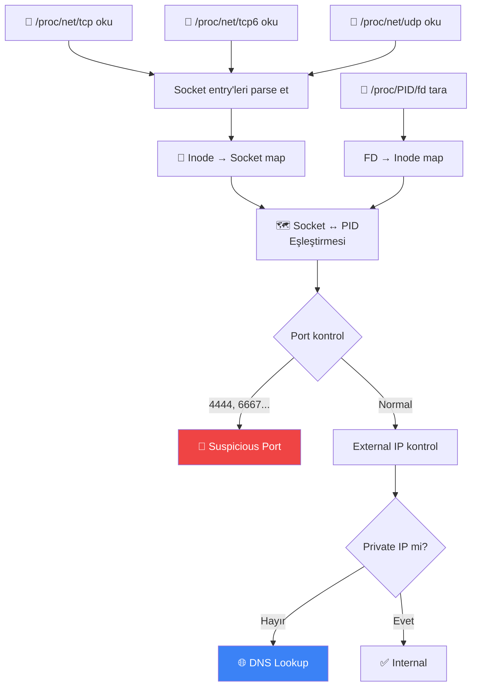
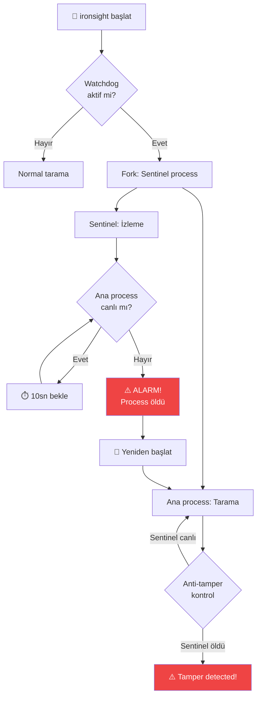
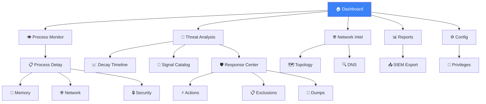

# IronSight — Mermaid Diyagramları

> Tüm temel mantık akışlarının görsel açıklamaları.

---

## 1. Ana Tarama Pipeline'ı

---

## 2. Heuristic Puanlama Akışı

---

## 3. Decay Engine Mantığı

---

## 4. Forensik Müdahale Sırası

---

## 5. Bellek W^X İhlal Tespiti

---

## 6. Ağ Socket Haritalama

---

## 7. Watchdog Sentinel Döngüsü

---

## 8. Dashboard Sayfa Navigasyonu

